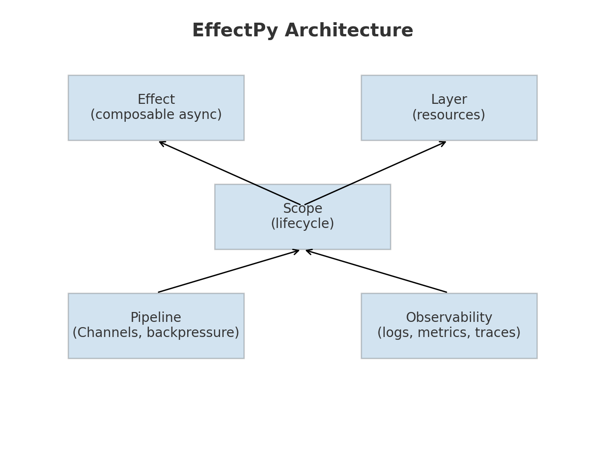

# effectpy

Effect/ZIO-inspired structured async for Python.

## Why effectpy?

`asyncio` is powerful but messy: exceptions leak, cancellations are tricky, resources are forgotten, and observability is bolted on later.  
**effectpy** brings the semantics of [Effect TS](https://effect.website) / [ZIO](https://zio.dev) into Python, giving you:

- **Structured async without spaghetti**
  - Every async operation is an `Effect` you can compose, transform, retry, race, zip, and run in parallel.

- **Automatic resource safety**
  - `Layer` + `Scope` ensure resources are acquired and released correctly, in order.

- **Structured errors, not random exceptions**
  - Failures are rich `Cause` trees: fail, die, interrupt, both, then — with annotations and stack traces.

- **Deterministic concurrency**
  - Built-ins for `race`, `zip_par`, `for_each_par`, cancellation masks, `FiberRef` locals.
  - Works with both `asyncio` and `anyio` (Trio).

- **Observability baked in**
  - `instrument("name", tags={...})` logs, records metrics, and traces.
  - Export spans/metrics to OTLP/Prometheus/OpenTelemetry.

- **Composable streaming and pipelines**
  - `StreamE` with error channel.
  - Channels + Pipelines with backpressure.

- **Test-friendly clocks and supervision**
  - `TestClock` for deterministic time in tests.
  - Supervisors restart effects with retry schedules.

## Example: Scoped DB pipeline

```python
import asyncio
from effectpy import *

class DB:
    async def query(self, x: int) -> int:
        await asyncio.sleep(0.01)
        return x * 2

DBLayer = from_resource(DB, lambda _: DB(), lambda _: asyncio.sleep(0))

async def main():
    base = Context()
    scope = Scope()
    env = await (LoggerLayer | MetricsLayer | TracerLayer | DBLayer).build_scoped(base, scope)

    db = env.get(DB)
    src, out = Channel[int](2), Channel[int](2)

    async def producer():
        for i in range(5):
            await src.send(i)

    async def stage1(x: int) -> int: return (x + 1)
    async def stage2(x: int) -> int: return await db.query(x)

    pipe = Pipeline[int,int](src) \        .via(stage(stage1, workers=2)) \        .via(stage(stage2, workers=2)) \        .to_channel(out)

    async def consumer():
        for _ in range(5):
            print("OUT:", await out.receive())

    run = instrument("pipeline.run", pipe, tags={"component":"db","env":"dev"})
    await asyncio.gather(producer(), run._run(env), consumer())

    await scope.close()

asyncio.run(main())
```

Output:

```
OUT: 2
OUT: 4
OUT: 6
OUT: 8
OUT: 10
```

---

effectpy = **`asyncio` with guardrails and batteries**:
- Guardrails: structured errors, cancellation, resource safety
- Batteries: observability, retries, pipelines, test clocks, supervision

## More Examples

All examples are runnable directly:

- `examples/basic_effects.py`: Effect composition, error handling, and instrumentation.
  - Python (module): `python -m examples.basic_effects`
  - uv: `uv run python -m examples.basic_effects`
  - Alt: `PYTHONPATH=. uv run python examples/basic_effects.py`
- `examples/layers_resource_safety.py`: Layers + Scope with a fake DB resource, automatic teardown.
  - Python (module): `python -m examples.layers_resource_safety`
  - uv: `uv run python -m examples.layers_resource_safety`
  - Alt: `PYTHONPATH=. uv run python examples/layers_resource_safety.py`
- `examples/provide_layer_example.py`: Use `Effect.provide(...)` to scope a layer to a single effect.
  - Python (module): `python -m examples.provide_layer_example`
  - uv: `uv run python -m examples.provide_layer_example`
  - Alt: `PYTHONPATH=. uv run python examples/provide_layer_example.py`
- `examples/fibers_concurrency.py`: Run effects concurrently with `Runtime.fork`, observe exits, interrupt fibers.
  - Python (module): `python -m examples.fibers_concurrency`
  - uv: `uv run python -m examples.fibers_concurrency`
  - Alt: `PYTHONPATH=. uv run python examples/fibers_concurrency.py`
- `examples/pipelines_parallel.py`: Channels + Pipelines with parallel stages and observability.
  - Python (module): `python -m examples.pipelines_parallel`
  - uv: `uv run python -m examples.pipelines_parallel`
  - Alt: `PYTHONPATH=. uv run python examples/pipelines_parallel.py`
- `examples/anyio_runtime_example.py`: AnyIO-backed runtime (optional). Skips if `anyio` not installed.
  - Python (module): `python -m examples.anyio_runtime_example`
  - uv: `uv run python -m examples.anyio_runtime_example`
  - Alt: `PYTHONPATH=. uv run python examples/anyio_runtime_example.py`
- `examples/exporters_demo.py`: Export spans/metrics over OTLP HTTP (requires `aiohttp`, otherwise no-ops).
  - Python (module): `python -m examples.exporters_demo`
  - uv: `uv run python -m examples.exporters_demo`
  - Alt: `PYTHONPATH=. uv run python examples/exporters_demo.py`

## Running Tests

- Python: `python -m unittest discover -s tests -p 'test_*.py' -v`
- uv: `uv run python -m unittest discover -s tests -p 'test_*.py' -v`

Optional deps for specific examples:
- AnyIO example: install `anyio` (e.g., `uv pip install anyio`) or use a venv.
- Exporters demo: install `aiohttp` (e.g., `uv pip install aiohttp`).

## Makefile Shortcuts (uv-based)

- `make test`: runs the unit test suite with `uv run`.
- `make examples-list`: lists example targets.
- `make example-basic`: runs `examples/basic_effects.py`.
- `make example-layers`: runs `examples/layers_resource_safety.py`.
- `make example-provide`: runs `examples/provide_layer_example.py`.
- `make example-fibers`: runs `examples/fibers_concurrency.py`.
- `make example-pipelines`: runs `examples/pipelines_parallel.py`.
- `make example-anyio`: runs `examples/anyio_runtime_example.py` (requires `anyio`).
- `make example-exporters`: runs `examples/exporters_demo.py` (requires `aiohttp`).
- `make install-anyio`: installs AnyIO via `uv`.
- `make install-aiohttp`: installs aiohttp via `uv`.

## Running Examples Without Installing

You don’t need to install the package to run examples when working in this repo. Use module form so Python resolves the local `effectpy` package on `sys.path`:

- Python: `python -m examples.basic_effects`
- uv: `uv run python -m examples.basic_effects`

For scripts by file path, add the repo root to `PYTHONPATH`:

- `PYTHONPATH=. uv run python examples/basic_effects.py`

Or install in editable mode for a longer dev session:

- `uv pip install -e .`

## Publishing to PyPI

1) Set version in `pyproject.toml` (under `[project] version`).

2) Build artifacts (wheel + sdist):

- `uv build`

3) (Optional) Verify the distribution:

- `uvx twine check dist/*`

4a) Upload to TestPyPI first:

- `uvx twine upload --repository testpypi dist/*`

4b) Upload to PyPI:

- `uvx twine upload dist/*`

Notes:
- You’ll need PyPI credentials configured (via `~/.pypirc` or environment variables). `uvx` runs tools in ephemeral environments.
- If your `uv` version supports `uv publish`, you can use `uv publish` instead of the twine steps above.
